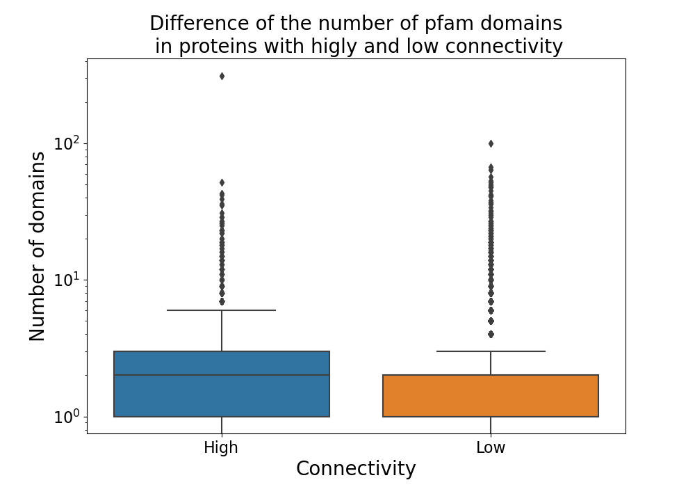

# Reoproducibility project

## Requirements

This project was validated on Ubunty 18.04 and singularity version 3.7.0

## Runing code

To generate results run  `make` 
to run tests run `python -m unittest`

## Singularity 

if you want to remake the singularity immage you can use the resipie image.def with the command 
` sudo singularity build image.sif image.def `

The dependencies can be managed in environment.yml

## Results
As can be seen in the plot the proteins that have more registerd interactions also have more registerd pfam domains on average.
The proteins that had no registerd pfam domains was excluded from the statistics.

